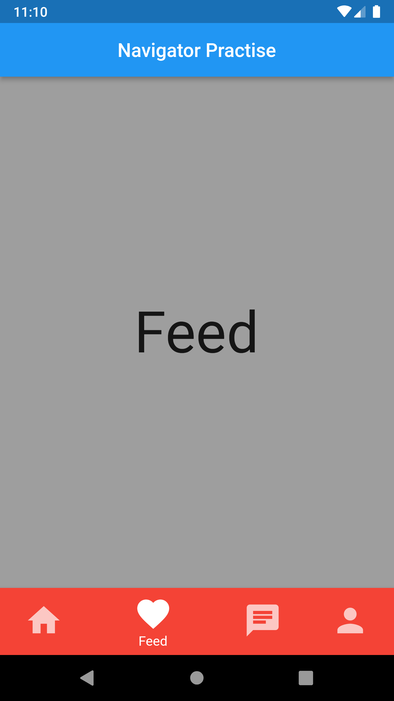
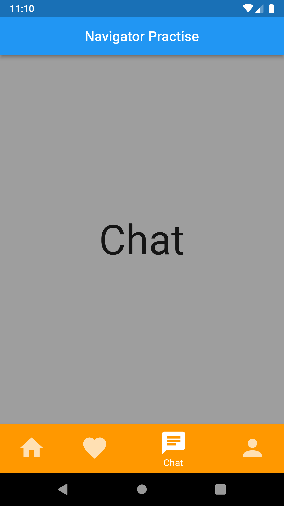

# bottom_navigator

---ScreenShots---

  |    |  

https://user-images.githubusercontent.com/102043234/170867383-8aabdbd1-6d28-4e05-9412-8a93fc93161d.mp4

Inspired on: [https://www.youtube.com/channel/UCU0XSqz_hWLJbmlr7kCmvAg](https://www.youtube.com/watch?v=xoKqQjSDZ60)

## Getting Started

This project is a starting point for a Flutter application.

A few resources to get you started if this is your first Flutter project:

- [Lab: Write your first Flutter app](https://flutter.dev/docs/get-started/codelab)
- [Cookbook: Useful Flutter samples](https://flutter.dev/docs/cookbook)

For help getting started with Flutter, view our
[online documentation](https://flutter.dev/docs), which offers tutorials,
samples, guidance on mobile development, and a full API reference.
